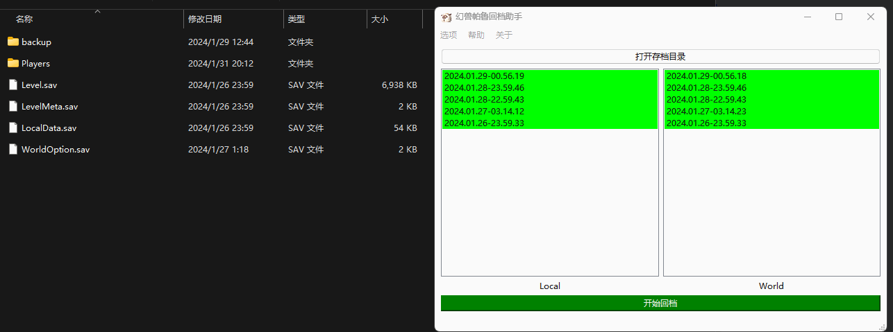
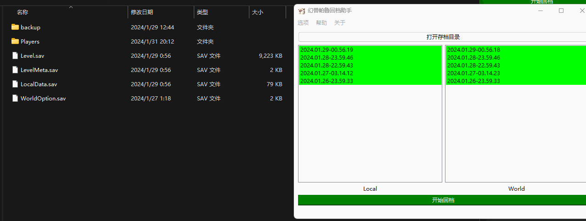

# PalworldArchiveManager

This project aims to provide a solution to the lack of official archive management functionality for Palworld on the Windows x64 platform.

## README.MD

- English version here : en_US [English](README.en.md)
- download address:  [EnglishVersionBinary DownloadHere](https://github.com/Yamico/PalworldArchiveManager/releases/download/pub/PalArchiveManager_en_US_0.4.exe)

## ABOUT

In most cases, games only automatically back up saves at certain time intervals, which may not be ideal for players who want to experiment with self-challenges or explore different possibilities in the game. Therefore, I have developed a rollback manager written in C++ to allow players more flexibility in saving and loading game progress. Since this is my first time using C++ and the Qt framework, there may be room for improvement. I eagerly await feedback and suggestions from the community to help me make improvements.

​        

## Usage

User Interface：

### Method 1:

### Method 2

After clicking "Open", it automatically navigates to the archive directory

After clicking to enter the directory, you should further search for the correct archive directory. The correct archive directory should contain the following two files:

After clicking "Select Folder" both sides will display the archives.

The archives under "Local" and "World" are sorted in reverse alphabetical order by folder name, with the newest directory appearing at the top.

## Rollback demonstration

The current archive will be automatically backed up.

You can delete these archives by opening "Hide manual backup" and enabling the delete switch.

## Updates

v0.5 support darkmode, drag and drop

