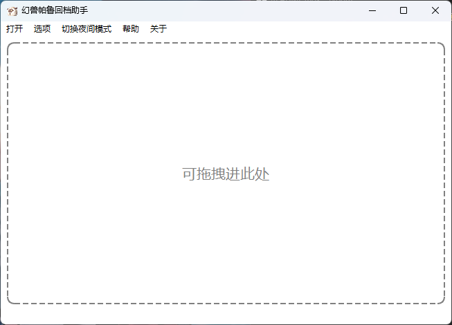
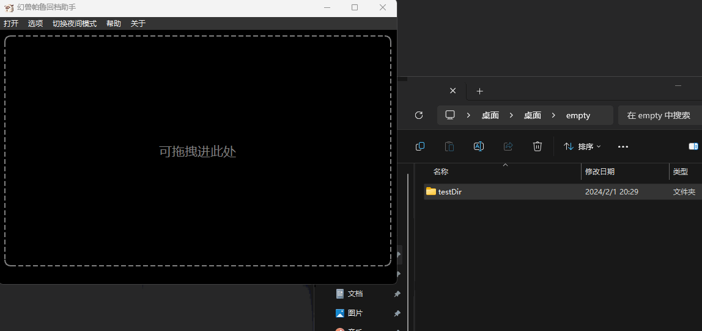
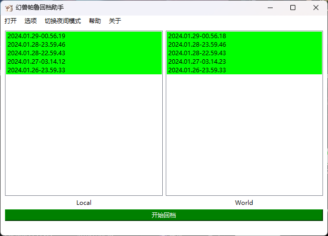
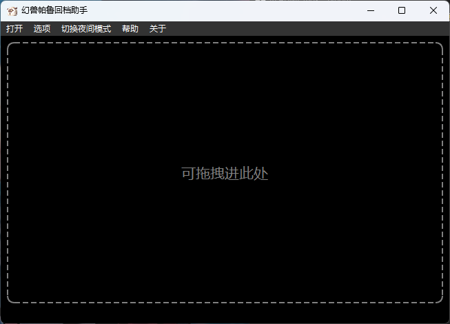

# 幻兽帕鲁回档管理器
本项目旨在为幻兽帕鲁(Palworld)缺乏官方存档管理功能的问题提供一个解决方案。基于windows x64平台。

## README.MD

- English version click here : en_US [English](README.en.md)
- download address:  [en_US_Binary Download Here](https://github.com/Yamico/PalworldArchiveManager/releases/download/pub/PalArchiveManager_en_US_0.5.exe)
- 下载地址: [中文下载地址](https://github.com/Yamico/PalworldArchiveManager/releases/download/pub/PalArchiveManager_zh_CN_0.5.exe)       

## ABOUT
通常情况下，游戏仅会在一定时间间隔后自动备份存档，这对于那些想尝试自我挑战或探索游戏不同可能性的玩家来说并不理想。因此，我开发了一个用C++编写的回档管理器，以便玩家能够更灵活地保存和加载游戏进度。由于这是我初次使用C++和Qt框架，可能存在不足之处。我热切期待社区的反馈和建议，以帮助我改进。

## 使用方式

用户界面：

### 方式一：

### 方式二

点击打开后，自动定位到存档目录

点击进入目录后，再查找目录。正确的存档目录下有以下两个文件：

点击选择文件夹。两侧即显示存档。

Local与World下存档以文件夹名称倒序排列，最上面的是最新的目录。

## 回档演示

当前存档会自动备份

你可以通过切换隐藏手动存档 ，和打开删除开关 来删除这些存档。

## 更新记录

v0.5更新加入黑暗模式，支持文件夹拖拽放置：

